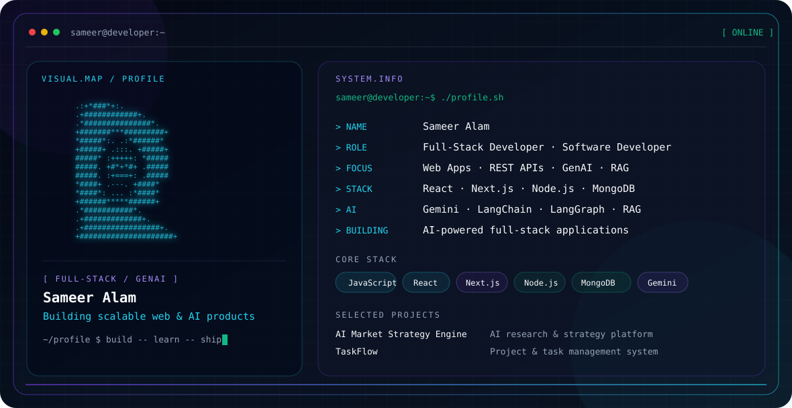

<!-- ===================================================== -->
<!--              SAMEER ALAM | GITHUB PROFILE             -->
<!-- ===================================================== -->

<picture>
  <source media="(prefers-color-scheme: dark)" srcset="./dark.svg">
  <source media="(prefers-color-scheme: light)" srcset="./light.svg">
  
</picture>

<br/>

<div align="center">

# 👋 Hi, I'm Sameer Alam

### 💻 Full Stack Developer • 👨‍💻 Software Developer • 🤖 AI Full Stack Developer Trainee

Building modern **Full-Stack Applications** and exploring  
**Generative AI • LLMs • RAG • LangChain • LangGraph**

<br/>

[](https://github.com/mdsameer2023)
[](https://instagram.com/tech_sameer.ai)
[](mailto:sameeralamrfj6@gmail.com)
[](https://github.com/mdsameer2023)

</div>

---

# 💫 About Me

Hi there! Nice meeting you, I'm **Sameer Alam**. 👋

I'm focused on **Full Stack Development, Software Development and Generative AI**, building responsive web applications, REST APIs, authentication systems, database-driven applications and AI-powered projects.

<br/>

💻 **Full Stack Developer**  
👨‍💻 **Software Developer**  
🤖 **AI Full Stack Developer Trainee**  
⚛️ Building applications with the **MERN / Next.js ecosystem**  
🧠 Working with **Gemini API, LangChain, LangGraph, RAG & LLMs**  
⚙️ Building **REST APIs, JWT Authentication & Database Applications**  
🌐 Developing **Responsive & Modern Web Applications**  
🚀 Building **Full-Stack + AI-Powered Projects**  
📚 Practicing **DSA, OOP, DBMS & Software Engineering Fundamentals**  
📈 **Problem Solver | Clean Code Enthusiast**

---

# 👨‍💻 Developer Profile

```javascript
const sameer = {
  name: "Sameer Alam",

  roles: [
    "Full Stack Developer",
    "Software Developer",
    "AI Full Stack Developer Trainee"
  ],

  frontend: [
    "JavaScript",
    "React.js",
    "Next.js",
    "Redux Toolkit",
    "Tailwind CSS"
  ],

  backend: [
    "Node.js",
    "Express.js",
    "REST APIs",
    "JWT"
  ],

  databases: [
    "MongoDB",
    "MySQL"
  ],

  generativeAI: [
    "Gemini API",
    "LangChain",
    "LangGraph",
    "RAG",
    "LLMs"
  ],

  tools: [
    "Git",
    "GitHub",
    "Postman",
    "Vercel",
    "Netlify"
  ],

  currentlyBuilding: "Full-Stack + AI-powered applications",

  goal: "Build scalable software that solves real-world problems"
};
